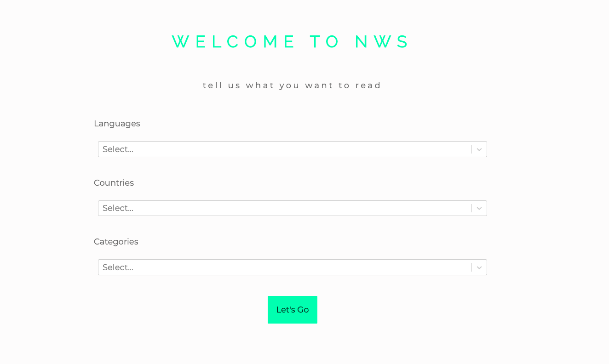
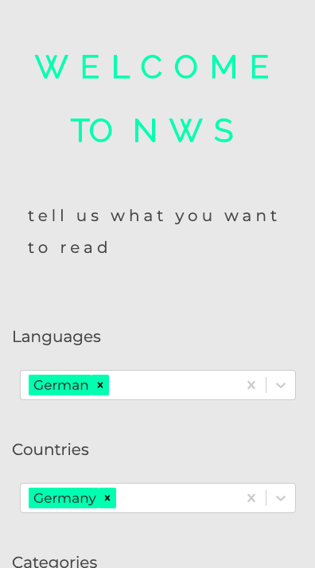

# NWS

This project was bootstrapped with [Create React App](https://github.com/facebook/create-react-app) and consumes the News Api (https://newsapi.org/docs). I undertook this project to push my understanding of test driven development, React Hooks, styled components and caching and also to practice using the React Select library I have been contributing to through open source.

## Available Scripts

In the project directory, you can run:

### `yarn start`

Runs the app in the development mode.<br />
Open [http://localhost:3000](http://localhost:3000) to view it in the browser.

The page will reload if you make edits.<br />
You will also see any lint errors in the console.

### `yarn test`

Launches the test runner in the interactive watch mode.<br />
See the section about [running tests](https://facebook.github.io/create-react-app/docs/running-tests) for more information.

## User Experience

When the user first lands on the website they have to fill in a form which saves to local storage the languages, countries and topics they want their newsfeed to contain. 

 


The user only has to fill this form once, but they do have the choice in their newsfeed to navigate back to their preferences if they do want to change it. 

Once on the newsfeed, the user can filter through articles if they are interested in more than one category. 

From each article, the user can expand to read more and if they click on the category of the article that filters the newsfeed to the articles in that category.

----

## Styling

I used themes to change the appearance of the app based on the time of day. If it's after 8pm and before 8am the app has a dark theme, otherwise it has a light theme. Here is an example of an article in dark/light theme:

 

----

## Challenges

The hardest part of the project was using Memoize to cache two of my api request functions promises so that if a function is called twice with the same arguments, it will return the same cached value the second time. This makes the app faster and it ensures I don't make too many calls to the API (since it has a daily cap on how many calls you can make). Here is the code snippet:

```javascript
const [articles, setData] = useState([]);

  useEffect(() => {

    //if a function is called twice with the same arguments, it will return the same cached value the second time.
    const memoize = (method) => {
      //I'm caching the promise returned by the method, not the final value. 
      //SO I don’t need to wait for the async method to return anything, before we cache it’s future value.
      return async function () {
        let cache = {};
        let args = JSON.stringify(arguments);
        cache[args] = cache[args] || method.apply(this, arguments);
        return cache[args];
      };
    }

    // 2. Get the top headlines from the sources returned from getSourcesData
    const getArticlesData = memoize(async (source) => {
      ...
    });

    // 1. first I need to get the sources that may include articles with the user's choices
    const getSourcesData = memoize(async (language, country, category) => {
      ...
    });

    const memoizedData = memoize(async () => {
      let sourcesArray = await getSourcesData(language, country, category);
      return sourcesArray ? await sourcesArray.map(getArticlesData) : null ;
    })

    //After the first call, I’ll always get a cached result, even if I call one of these methods again before it has returned for the first time.
    memoizedData();

  }, [category, country, language, token]);
```

This exercise definitely pushed my understanding of promises in JavaScript and all whilst using React Hooks syntax for the first time. 

----

## Future features

In the future, I was to continue building on the tests of the app to make sure they cover a lot more than they currently to. I also want to learn more about Redux so I will use this as a playground. 


